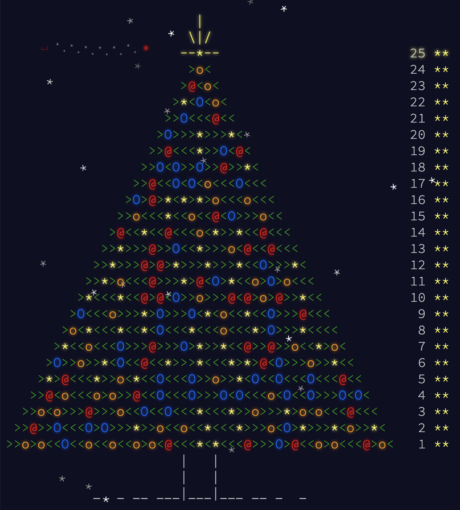

# [Advent of Code 2015](https://adventofcode.com/2015)


My answers for Advent of Code 2015.[^disclaimer]

## Introduction

### Language, Libraries and Frameworks

Language of choice: [Python 3](https://www.python.org/)

* [Wikipedia - Python](https://en.wikipedia.org/wiki/Python_(programming_language))
* [UV](https://docs.astral.sh/uv/)
* [Ruff](https://docs.astral.sh/ruff/)
* [pytest](https://docs.pytest.org/)
* [pytest-cov](https://pytest-cov.readthedocs.io/en/latest/)
* [mypy](https://mypy-lang.org/)

### History

I actually started Advent of Code in 2017 using Java. I decided to do the previous 2 years (2015, 2016) in Python to practice a bit and because it is the go-to language used by most of the competitive programmers that I follow. Don't get me wrong here, I'm _super slow_, but it does not prevent me from enjoying these incredibly fast programmers and watch them solve things. I'm here for the fun of it, not to win any contest. :smile:

## Problems, Solutions and Blog Posts

| Problem | Solution | Blog Post |
| ------- | -------- | --------- |
| [Day 3: Perfectly Spherical Houses in a Vacuum](https://adventofcode.com/2015/day/3) |[day_03.py](src/aoc/day_03.py)|[day03.md](doc/day03.md)|
| [Day 5: Doesn't He Have Intern-Elves For This?](https://adventofcode.com/2015/day/5) |[day_05.py](src/aoc/day_05.py)|[day05.md](doc/day05.md)|
| [Day 9: All in a Single Night](https://adventofcode.com/2015/day/9)                  |[day_09.py](src/aoc/day_09.py)|[day09.md](doc/day09.md)|
| [Day 11: Corporate Policy](https://adventofcode.com/2015/day/11)                     |[day_11.py](src/aoc/day_11.py)|[day11.md](doc/day11.md)|
| [Day 15: Science for Hungry People](https://adventofcode.com/2015/day/15)            |[day_15.py](src/aoc/day_15.py)|[day15.md](doc/day15.md)|

## Statistics

Some `pytest` + `coverage` statistics:

```
============================= test session starts ==============================
platform linux -- Python 3.13.1, pytest-8.3.4, pluggy-1.5.0
rootdir: /home/runner/work/aoc-2015/aoc-2015/test
configfile: pyproject.toml
plugins: cov-6.0.0
collected 169 items
test_day_01.py ..............                                            [  8%]
test_day_02.py ......                                                    [ 11%]
test_day_03.py ........                                                  [ 16%]
test_day_04.py .......                                                   [ 20%]
test_day_05.py ......                                                    [ 24%]
test_day_06.py ......                                                    [ 27%]
test_day_07.py ....                                                      [ 30%]
test_day_08.py ....                                                      [ 32%]
test_day_09.py ....                                                      [ 34%]
test_day_10.py ............                                              [ 42%]
test_day_11.py ......                                                    [ 45%]
test_day_12.py ..............                                            [ 53%]
test_day_13.py ....                                                      [ 56%]
test_day_14.py ....                                                      [ 58%]
test_day_15.py .....                                                     [ 61%]
test_day_16.py ....                                                      [ 63%]
test_day_17.py ....                                                      [ 66%]
test_day_18.py ....                                                      [ 68%]
test_day_19.py ....                                                      [ 71%]
test_day_20.py ............................                              [ 87%]
test_day_21.py ....                                                      [ 89%]
test_day_22.py ....                                                      [ 92%]
test_day_23.py ....                                                      [ 94%]
test_day_24.py .....                                                     [ 97%]
test_day_25.py ....                                                      [100%]
---------- coverage: platform linux, python 3.13.1-final-0 -----------
Name                                                Stmts   Miss  Cover   Missing
---------------------------------------------------------------------------------
/home/runner/work/aoc-2015/aoc-2015/src/day_01.py      13      0   100%
/home/runner/work/aoc-2015/aoc-2015/src/day_02.py      13      0   100%
/home/runner/work/aoc-2015/aoc-2015/src/day_03.py      29      0   100%
/home/runner/work/aoc-2015/aoc-2015/src/day_04.py      14      0   100%
/home/runner/work/aoc-2015/aoc-2015/src/day_05.py      14      0   100%
/home/runner/work/aoc-2015/aoc-2015/src/day_06.py      35      0   100%
/home/runner/work/aoc-2015/aoc-2015/src/day_07.py      36      0   100%
/home/runner/work/aoc-2015/aoc-2015/src/day_08.py      11      0   100%
/home/runner/work/aoc-2015/aoc-2015/src/day_09.py      27      0   100%
/home/runner/work/aoc-2015/aoc-2015/src/day_10.py      16      0   100%
/home/runner/work/aoc-2015/aoc-2015/src/day_11.py      17      0   100%
/home/runner/work/aoc-2015/aoc-2015/src/day_12.py      19      0   100%
/home/runner/work/aoc-2015/aoc-2015/src/day_13.py      31      0   100%
/home/runner/work/aoc-2015/aoc-2015/src/day_14.py      24      0   100%
/home/runner/work/aoc-2015/aoc-2015/src/day_15.py      53      0   100%
/home/runner/work/aoc-2015/aoc-2015/src/day_16.py      24      0   100%
/home/runner/work/aoc-2015/aoc-2015/src/day_17.py       8      0   100%
/home/runner/work/aoc-2015/aoc-2015/src/day_18.py      50      0   100%
/home/runner/work/aoc-2015/aoc-2015/src/day_19.py      23      0   100%
/home/runner/work/aoc-2015/aoc-2015/src/day_20.py      28      0   100%
/home/runner/work/aoc-2015/aoc-2015/src/day_21.py      57      0   100%
/home/runner/work/aoc-2015/aoc-2015/src/day_22.py      76      0   100%
/home/runner/work/aoc-2015/aoc-2015/src/day_23.py      34      0   100%
/home/runner/work/aoc-2015/aoc-2015/src/day_24.py      68      0   100%
/home/runner/work/aoc-2015/aoc-2015/src/day_25.py      11      0   100%
---------------------------------------------------------------------------------
TOTAL                                                 731      0   100%
======================= 169 passed in 276.77s (0:04:36) ========================
```

<!--- advent_readme_stars table --->
## 2015 Results

| Day | Part 1 | Part 2 |
| :---: | :---: | :---: |
| [Day 1](https://adventofcode.com/2015/day/1) | ⭐ | ⭐ |
| [Day 2](https://adventofcode.com/2015/day/2) | ⭐ | ⭐ |
| [Day 3](https://adventofcode.com/2015/day/3) | ⭐ | ⭐ |
| [Day 4](https://adventofcode.com/2015/day/4) | ⭐ | ⭐ |
| [Day 5](https://adventofcode.com/2015/day/5) | ⭐ | ⭐ |
| [Day 6](https://adventofcode.com/2015/day/6) | ⭐ | ⭐ |
| [Day 7](https://adventofcode.com/2015/day/7) | ⭐ | ⭐ |
| [Day 8](https://adventofcode.com/2015/day/8) | ⭐ | ⭐ |
| [Day 9](https://adventofcode.com/2015/day/9) | ⭐ | ⭐ |
| [Day 10](https://adventofcode.com/2015/day/10) | ⭐ | ⭐ |
| [Day 11](https://adventofcode.com/2015/day/11) | ⭐ | ⭐ |
| [Day 12](https://adventofcode.com/2015/day/12) | ⭐ | ⭐ |
| [Day 13](https://adventofcode.com/2015/day/13) | ⭐ | ⭐ |
| [Day 14](https://adventofcode.com/2015/day/14) | ⭐ | ⭐ |
| [Day 15](https://adventofcode.com/2015/day/15) | ⭐ | ⭐ |
| [Day 16](https://adventofcode.com/2015/day/16) | ⭐ | ⭐ |
| [Day 17](https://adventofcode.com/2015/day/17) | ⭐ | ⭐ |
| [Day 18](https://adventofcode.com/2015/day/18) | ⭐ | ⭐ |
| [Day 19](https://adventofcode.com/2015/day/19) | ⭐ | ⭐ |
| [Day 20](https://adventofcode.com/2015/day/20) | ⭐ | ⭐ |
| [Day 21](https://adventofcode.com/2015/day/21) | ⭐ | ⭐ |
| [Day 22](https://adventofcode.com/2015/day/22) | ⭐ | ⭐ |
| [Day 23](https://adventofcode.com/2015/day/23) | ⭐ | ⭐ |
| [Day 24](https://adventofcode.com/2015/day/24) | ⭐ | ⭐ |
| [Day 25](https://adventofcode.com/2015/day/25) | ⭐ | ⭐ |
<!--- advent_readme_stars table --->

## Other

### Advent of Code 2015 Final Art



### Credits

[Ned Batchelder](https://github.com/nedbat) did an amazing job on his [aoc2015 repo](https://github.com/nedbat/adventofcode2015). I took a lot of "inspiration" from there. :smile:

I also learned stuff from several other developers with much less extent. You can find some amazing people through this event.

[^disclaimer]: **Disclaimer**: I do AoC for fun and to learn new languages and new tricks. Part of my learning process (also for fun, even if I
already have experience with some language), is to check what other users do and learn things from them. I can't help but incorporate
their cool, clean, concise ideas into my code. Sometimes their code is *so* much better than mine that I end up replacing my whole code!
So I *do* come up with answers on my own, but I can't claim being the author of anything here - I'm not tracking what is mine and what I replaced. 🤷🏽‍
