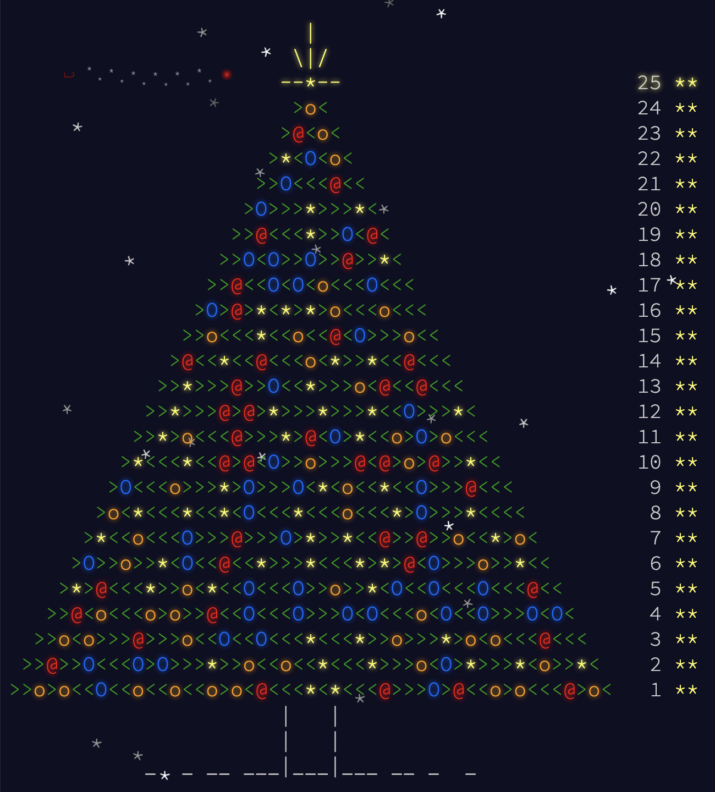

# [Advent of Code 2015](https://adventofcode.com/2015)


My answers for Advent of Code 2015.[^disclaimer]

## Introduction

### Language, Libraries and Frameworks

Language of choice: [Python 3](https://www.python.org/)

* [Wikipedia - Python](https://en.wikipedia.org/wiki/Python_(programming_language))
* [mypy](http://mypy-lang.org/)
* [Flake8](https://flake8.pycqa.org/)
* [pytest](https://docs.pytest.org/)
* [tox](https://pypi.org/project/tox/)

### History

I actually started Advent of Code in 2017 using Java. I decided to do the previous 2 years (2015, 2016) in Python to practice a bit and because it is the go-to language used by most of the competitive programmers that I follow. Don't get me wrong here, I'm _super slow_, but it does not prevent me from enjoying these incredibly fast programmers and watch them solve things. I'm here for the fun of it, not to win any contest. :smile:

## Problems, Solutions and Blog Posts

| Problem | Solution | Blog Post |
| ------- | -------- | --------- |
| [Day 3: Perfectly Spherical Houses in a Vacuum](https://adventofcode.com/2015/day/3) |[day_03.py](src/aoc/day_03.py)|[day03.md](blog/day03.md)|
| [Day 5: Doesn't He Have Intern-Elves For This?](https://adventofcode.com/2015/day/5) |[day_05.py](src/aoc/day_05.py)|[day05.md](blog/day05.md)|
| [Day 9: All in a Single Night](https://adventofcode.com/2015/day/9)                  |[day_09.py](src/aoc/day_09.py)|[day09.md](blog/day09.md)|
| [Day 11: Corporate Policy](https://adventofcode.com/2015/day/11)                     |[day_11.py](src/aoc/day_11.py)|[day11.md](blog/day11.md)|
| [Day 15: Science for Hungry People](https://adventofcode.com/2015/day/15)            |[day_15.py](src/aoc/day_15.py)|[day15.md](blog/day15.md)|

## Statistics

Some `pytest` + `coverage` statistics:

```
=========================== test session starts ============================
platform darwin -- Python 3.8.9, pytest-6.2.5, py-1.11.0, pluggy-1.0.0
configfile: pyproject.toml, testpaths: test
plugins: cov-2.12.1
collected 140 items                                                        

test/test_day_01.py ..............                                   [ 10%]
test/test_day_02.py ......                                           [ 14%]
test/test_day_03.py ........                                         [ 20%]
test/test_day_04.py .....                                            [ 23%]
test/test_day_05.py ......                                           [ 27%]
test/test_day_06.py .....                                            [ 31%]
test/test_day_07.py ..                                               [ 32%]
test/test_day_08.py ....                                             [ 35%]
test/test_day_09.py ....                                             [ 38%]
test/test_day_10.py ..                                               [ 40%]
test/test_day_11.py ....                                             [ 42%]
test/test_day_12.py ..............                                   [ 52%]
test/test_day_13.py ...                                              [ 55%]
test/test_day_14.py ....                                             [ 57%]
test/test_day_15.py ....                                             [ 60%]
test/test_day_16.py ..                                               [ 62%]
test/test_day_17.py ....                                             [ 65%]
test/test_day_18.py ....                                             [ 67%]
test/test_day_19.py ....                                             [ 70%]
test/test_day_20.py ............................                     [ 90%]
test/test_day_21.py ....                                             [ 93%]
test/test_day_22.py ..                                               [ 95%]
test/test_day_23.py ..                                               [ 96%]
test/test_day_24.py ...                                              [ 98%]
test/test_day_25.py ..                                               [100%]

---------- coverage: platform darwin, python 3.8.9-final-0 -----------
Name                Stmts   Miss  Cover   Missing
-------------------------------------------------
src/aoc/day_01.py      13      0   100%
src/aoc/day_02.py      14      0   100%
src/aoc/day_03.py      30      0   100%
src/aoc/day_04.py      14      0   100%
src/aoc/day_05.py      15      0   100%
src/aoc/day_06.py      36      0   100%
src/aoc/day_07.py      37      0   100%
src/aoc/day_08.py      12      0   100%
src/aoc/day_09.py      28      0   100%
src/aoc/day_10.py      16      0   100%
src/aoc/day_11.py      17      0   100%
src/aoc/day_12.py      20      0   100%
src/aoc/day_13.py      32      0   100%
src/aoc/day_14.py      25      0   100%
src/aoc/day_15.py      54      0   100%
src/aoc/day_16.py      24      0   100%
src/aoc/day_17.py       9      0   100%
src/aoc/day_18.py      53      0   100%
src/aoc/day_19.py      23      0   100%
src/aoc/day_20.py      28      0   100%
src/aoc/day_21.py      56      0   100%
src/aoc/day_22.py      77      0   100%
src/aoc/day_23.py      33      0   100%
src/aoc/day_24.py      70      0   100%
src/aoc/day_25.py      11      0   100%
-------------------------------------------------
TOTAL                 747      0   100%


===================== 140 passed in 283.70s (0:04:43) ======================
```

<!--- advent_readme_stars table --->

## Other

### Advent of Code 2015 Final Art



### Credits

[Ned Batchelder](https://github.com/nedbat) did an amazing job on his [aoc2015 repo](https://github.com/nedbat/adventofcode2015). I took a lot of "inspiration" from there. :smile:

I also learned stuff from several other developers with much less extent. You can find some amazing people through this event.

[^disclaimer]: **Disclaimer**: I do AoC for fun and to learn new languages and new tricks. Part of my learning process (also for fun, even if I
already have experience with some language), is to check what other users do and learn things from them. I can't help but incorporate
their cool, clean, concise ideas into my code. Sometimes their code is *so* much better than mine that I end up replacing my whole code!
So I *do* come up with answers on my own, but I can't claim being the author of anything here - I'm not tracking what is mine and what I replaced. 🤷🏽‍
